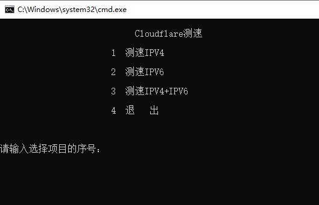
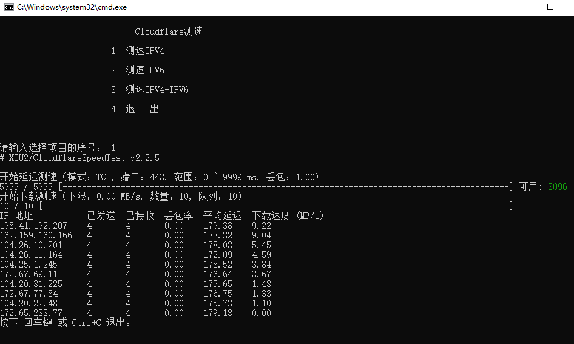
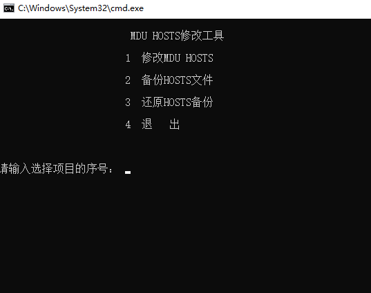
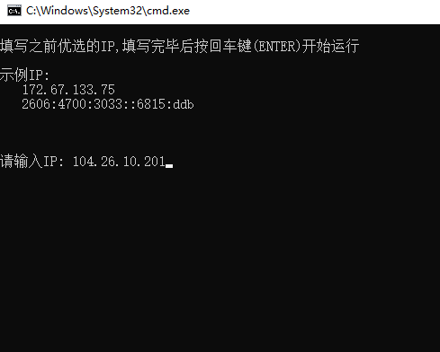

# 解决站点访问缓慢/不定时无法访问/访问不通
## 1.Cloudflare测速
1. 下载 [测速脚本](https://github.com/exernest/Files/releases/download/0.1/Cloudflare.zip) 并解压。 [备用链1](https://ghproxy.org/https://github.com/exernest/Files/releases/download/0.1/Cloudflare.zip)  [备用链2](https://mirror.ghproxy.com/https://github.com/exernest/Files/releases/download/0.1/Cloudflare.zip)
2. 双击运行解压后文件夹内的 <kbd>Cloudflare.bat</kbd> 文件。
 

 
运行后类似此图

 
 

3. 运行后选择要测速的项目，输入对应的数字即可开始测速。
4. 耐心等待测速完毕并记录测速后的结果。

测速后的结果类似此图

 

**注意事项:**
- 如提示 **跳过下载测速/跳过输出结果**，则是当前网络环境无法连接到 Cloudflare。
- 如提示 **跳过下载测速/跳过输出结果**，也可能是选择了测试 IPv6 但本地没有IPv6。
- 建议优先测试 IPv6 。

****

## 2.修改HOSTS
1. 双击运行解压后文件夹内的 <kbd>hosts.bat</kbd> 文件（会提示需要管理员权限）。
 

 
运行后类似此图

 
 

2. 输入 1 以运行 修改MDU HOSTS 项目。
3. 填入之前测速结果排名靠前的任意一个IP
 

 
类似这样

 
 
 

4. 等待运行完毕后是否可以访问 [MDU Tracker](https://daisuki.monikadesign.uk) 或 [MDU主站](https://monikadesign.uk/)

**注意事项:**
- 可能需要重启浏览器(含后台)后测试能否访问本站。
- 可能需要重启BT客户端后测试能否访问本站Tracker。
- 如遇网络异常可尝试还原hosts。
- 建议优先尝试替换为 IPv6 的 IP 测试是否可以访问。

****

### 感谢项目
- _https://github.com/XIU2/CloudflareSpeedTest_

